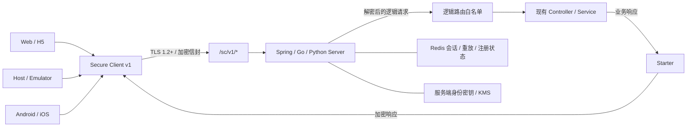

# Secure Communication SDK 1.0

Secure Communication SDK 为已有 HTTP 业务增加一层应用层安全通信能力。业务仍使用
原来的 Controller、请求模型和幂等逻辑，客户端把逻辑 method、path、受保护 header
和 body 封装到加密信封中，服务端完成握手、身份确认、解密、路由授权和响应加密。

它不是 TLS 的替代品。生产环境仍必须使用 TLS 1.2 或更高版本；SDK 在 TLS 之上提供
服务端身份固定、安装身份持有证明、会话密钥协商、机密性、完整性和重放保护。

## 解决什么问题

直接在各业务端分别实现加密、验签和防重放，容易出现算法、字段和错误处理不一致，
也会把安全逻辑散落到业务代码中。本 SDK 提供统一协议和多端实现，重点解决：

- 防止 HTTP 业务字段、内部路由和受保护 header 以明文出现在应用层报文中；
- 检测密文、元数据和响应被篡改；
- 使用时间戳、会话序号和滑动窗口拒绝过期或重复请求；
- 通过服务端公钥固定和客户端安装私钥持有证明确认通信端身份；
- 只允许解密后的请求进入宿主配置的逻辑路由白名单；
- 让业务继续维护自己的 message ID、batch ID、顺序和幂等语义。

## 1.0 能力与边界

当前协议版本为 v1，首发密码套件固定为
`P256_HKDF_SHA256_AES256_GCM`：P-256 用于身份签名和临时 ECDH，HKDF-SHA256
派生会话材料，AES-256-GCM 保护请求和响应。

1.0 已提供：

- 固定的握手、握手确认和消息入口；
- 服务端身份信任锚固定及安装身份注册；
- 每个会话独立的双向密钥、nonce 前缀和传输序号；
- 请求与响应加密、完整性校验、时效校验和重放保护；
- Spring Boot、Go `net/http`、Python ASGI 服务端的逻辑路由白名单、请求重写和响应加密；
- JavaScript、Go、Android、iOS 客户端及统一生命周期接口；
- Redis 会话、注册、重放保护和会话记录加密扩展点。

以下能力不属于 1.0：旧协议兼容或自动降级、TCP/UDP/WebSocket 适配、动态协议
变形、流量伪装、URL 混淆、客户端防逆向和安全策略热更新。国密套件目前只保留
Provider 扩展边界，接入经审计实现前不得启用。

## 架构



外层协议入口固定为：

- `POST /sc/v1/handshake`
- `POST /sc/v1/handshake/finish`
- `POST /sc/v1/message`

原始业务 path 不直接暴露为安全入口，而是作为密文中的逻辑路由。宿主必须明确
授权允许访问的逻辑路由。

## 交付物

| 平台 | 交付物 | 适用场景 | 接入文档 |
| --- | --- | --- | --- |
| Spring Boot | `com.coolxer.securecommunication:secure-communication-spring-boot-starter:1.0.0` | 服务端安全接入层 | [Spring Boot](server/spring-boot/README.md) |
| Go Server | `github.com/coolxer/secure-communication-server-go` | `net/http` 服务端安全接入层 | [Go Server](server/go/README.md) |
| Python Server | `secure-communication-server` | FastAPI / ASGI 服务端安全接入层 | [Python Server](server/python/README.md) |
| JavaScript | `@coolxer/secure-communication-js@1.0.0` | Web / H5 | [JavaScript](client/javascript/README.md) |
| Go | `github.com/coolxer/secure-communication-go` | Host / Emulator | [Go](client/go/README.md) |
| Android | `com.coolxer.securecommunication:secure-communication-android:1.0.0` | Android Agent | [Android](client/android/README.md) |
| iOS | Swift Package `SecureCommunication` | iOS Agent | [iOS](client/ios/README.md) |

客户端统一提供 `initialize`、`enroll`、`request` 和 `closeSession` 生命周期。H5
通过 HTTPS、Origin 准入和不可导出的 WebCrypto 安装密钥建立身份，不调用
`enroll`；Host、Emulator、Android 和 iOS 首次安装必须使用短时、单次注册令牌。

## 推荐接入顺序

1. 生成 P-256 服务端身份密钥，为私钥选择环境变量、密钥文件或 KMS 加载方式。
2. 选择 Spring Boot、Go 或 Python 服务端 SDK，实现身份、授权、会话、重放和注册等 SPI。
3. 配置允许访问的逻辑路由、Redis 独立命名空间、请求大小和 CORS。
4. 通过独立可信渠道把服务端 `keyId` 和公开 SPKI 信任锚分发给全部客户端。
5. 原生端或 Host 使用一次性令牌完成首次注册，H5 通过 Origin 策略准入。
6. 调用 `initialize` 建立会话，再用 `request` 替代原业务 HTTP 发送入口。
7. 使用统一测试向量验证各端，并完成篡改、重放、过期、超限和密钥轮换测试。

SDK 不自动重试业务 POST。调用方重试时必须重新调用 `request`，由 SDK 使用新的
传输序号和 request ID 重新加密，同时保留原业务 message ID、batch ID 和幂等标识。

## 文档导航

- [文档中心](docs/文档中心.md)：架构、协议、安全、兼容性和各 SDK 导航；
- [完整接入与调试指南](docs/接入与调试指南.md)：跨端配置、密钥生成、本地联调、错误排查和上线清单；
- [协议 v1 规范](docs/protocol/协议v1.md)：握手、信封、AAD、路由、重试和错误语义；
- [协议错误码](docs/protocol/协议错误码.md)：统一 HTTP 状态、错误分类与重试策略；
- [Security Policy](SECURITY.md)：受支持版本、漏洞报告和生产部署要求；
- [Changelog](CHANGELOG.md)：版本变更记录；
- [Spring Boot Starter](server/spring-boot/spring-boot-starter-sc/README.MD)：服务端最小接入；
- [Go Server SDK](server/go/README.md)：`net/http`、Redis、扩展接口与 Demo；
- [Python Server SDK](server/python/README.md)：FastAPI/ASGI、异步 Redis 与 Demo；
- [Spring Boot Demo](server/spring-boot/SpringBootDemo/README.md)：示例工程运行边界；
- [Android Demo](client/android/app/README.md)：Android 示例壳工程说明。

## 源码验证

```bash
cd server/spring-boot/spring-boot-starter-sc && mvn test
cd server/go && go test ./...
cd server/python && pytest && python -m build
cd client/javascript && npm ci && npm test
cd client/go && go test ./...
cd client/android && ./gradlew :secure-communication:test
cd client/ios && swift test
```

## 后续路线

后续版本可在协议评审和安全审计后增加国密 Provider、密钥与策略轮换、集中化安全
观测和更多受控传输适配。动态协议变形、流量伪装等能力如进入实现，必须作为独立
版本设计和验证，不能被视为当前 1.0 的安全保证。
