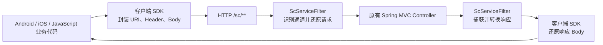

# Secure Communication

一个用于验证“客户端封装请求、服务端透明解包与回包”的跨端 HTTP 通信保护原型。仓库包含 Android、iOS、JavaScript 和 Spring Boot 四部分，当前实现覆盖 URI 变换、SM4 请求/响应 Body 加解密、应用标识校验，以及备用和 H5 两种兼容通道。

> [!WARNING]
> 本项目目前是实验性原型，不是可直接用于生产的安全 SDK。代码中存在硬编码服务地址、固定密钥、明文 HTTP、无消息认证等问题；备用通道仅做 Base64 变换，不提供加密保护。请先阅读[安全边界与已知问题](#安全边界与已知问题)。

## 当前实现

| 组件 | 技术栈 | 当前能力 | 状态 |
| --- | --- | --- | --- |
| Spring Boot Starter | Java 17、Spring Boot 3.0.2、Jakarta Servlet | Filter 自动解包/回包、三种通道路由、应用标识白名单、URI 去重队列 | 可编译，单元测试有 1 个已知错误 |
| Spring Boot Demo | Java 17、Spring Boot 3.0.2 | 示例 Controller 和 Starter 集成 | 上下文测试通过 |
| Android SDK | Java、JNI、C/C++、SM4 | `get` / `post` API、标准通道、备用通道、应用包名与签名标识 | 源码原型，无已发布 AAR |
| Android Demo | Android App | SDK 调用示例 | 需要先修改服务地址 |
| iOS SDK | Objective-C、C、SM4 | `get` / `post` API、标准通道代码、备用通道 | 当前逻辑被硬编码为始终使用备用通道 |
| iOS Demo | Objective-C App | SDK 调用示例 | 需要先修改服务地址 |
| JavaScript SDK | JavaScript、SM4-CBC、MD5 | H5 通道请求封装、响应解封、本地文本加解密，提供 CJS/ESM/UMD | 可独立构建和测试，尚未发布 npm |

当前代码**没有实现**安全握手、密钥协商、签名/HMAC、可靠的时间戳或 nonce 防重放、AES/SM2/SM3/SHA256、TCP/UDP/WebSocket 适配、策略热更新、安全监控或集群会话同步。

## 工作方式



服务端 Starter 注册 `ScServiceFilter`，只处理以 `spring.sc.prefix` 开头的请求；其他请求原样进入应用。Filter 通过 `HttpServletRequestWrapper` 替换业务 URI、查询参数和 Body，再通过 `HttpServletResponseWrapper` 捕获 Controller 响应并编码。

### 三种通道

| 通道 | 外部路径 | URI 处理 | Body/响应处理 | 标识校验 | URI 去重 |
| --- | --- | --- | --- | --- | --- |
| 标准通道 | `/sc/{混合后的密钥与密文}` | 随机 16 字节小写密钥 + SM4-ECB + Base32，再将密钥字符混入密文 | 固定密钥与 IV 的 SM4-CBC + Base64 | 支持 | 支持，但实现有局限 |
| 备用通道 | `/sc/reserve/{变换后的URI}` | 随机数字前缀 + Base64 + 大小写反转 + URL 字符替换 | Base64 + 大小写反转 | 不支持 | 不支持 |
| H5 通道 | `/sc/h5/{业务路径}` | 路径不加密，仅移除通道前缀 | 动态派生密钥的 SM4-CBC + Hex | 不支持 | 不支持 |

备用通道中的字符替换规则为 `+ → !`、`/ → @`、`= → *`。这是一种编码/混淆方式，不是加密。

H5 请求 Body 的格式是：

```text
Hex(SM4-CBC(明文, key, iv)) + acceptHex
```

其中 `acceptHex` 固定占最后 32 个字符：

```text
md5 = MD5(lowercase(acceptHex) + "_bsdk_")
key = md5[0..15]
iv  = key
```

响应使用同一组 `key` 和 `iv` 做 SM4-CBC，再编码为 Hex。

### 标准通道请求流程

1. 客户端可在原始业务 URI 前拼接应用标识和 `->`。
   - Android 标识：`MD5(应用签名证书)-包名`
   - iOS 标准通道标识：`Bundle Seed ID-Bundle ID`
2. 客户端生成 16 字节小写 URI 密钥，用 SM4-ECB 加密完整 URI并转为 Base32。
3. 客户端将小写密钥字符随机混入只含大写字母和数字的 Base32 密文。
4. 服务端按字符大小写重新分离密钥与密文，解出真实 URI 和查询参数。
5. 服务端按配置校验应用标识；未配置白名单时，只移除客户端附带的标识。
6. 请求 Body 使用 SM4-CBC 加密并转为 Base64；响应执行相反流程。

Android 和 iOS 的标准通道还会附加 `scid: debug` 请求头。

## 仓库结构

```text
.
├── README.md
├── LICENSE
├── client/
│   ├── android/
│   │   ├── app/                         # Android 示例 App
│   │   └── secure-communication/        # Android Library、JNI 和 C 实现
│   ├── javascript/                      # H5 JavaScript SDK、构建产物和协议测试
│   └── ios/
│       ├── secure-communication-ios/    # iOS 示例 App
│       ├── secure-communication/        # Objective-C/C SDK 源码
│       └── secure-communication-ios.xcodeproj
└── server/
    └── spring-boot/
        ├── spring-boot-starter-sc/      # 自动配置、Filter、SM4/Base32/Base64
        └── SpringBootDemo/              # 服务端示例
```

关键入口：

- Android API：[`CTSecureCommunication.java`](client/android/secure-communication/src/main/java/com/coolxer/securecommunication/CTSecureCommunication.java)
- Android JNI：[`secure-communication.cpp`](client/android/secure-communication/src/main/cpp/secure-communication.cpp)
- iOS API：[`CTSecureCommunication.h`](client/ios/secure-communication/CTSecureCommunication.h)
- iOS 实现：[`CTSecureCommunication.m`](client/ios/secure-communication/CTSecureCommunication.m)
- JavaScript API：[`index.js`](client/javascript/src/index.js)
- JavaScript 使用说明：[`client/javascript/README.md`](client/javascript/README.md)
- 服务端 Filter：[`ScServiceFilter.java`](server/spring-boot/spring-boot-starter-sc/src/main/java/com/abc/sc/ScServiceFilter.java)
- 服务端配置：[`ScServiceProperties.java`](server/spring-boot/spring-boot-starter-sc/src/main/java/com/abc/sc/ScServiceProperties.java)
- Demo Controller：[`MessageController.java`](server/spring-boot/SpringBootDemo/src/main/java/com/abc/demo/controller/MessageController.java)

## 快速开始

### 环境要求

| 组件 | 建议环境 |
| --- | --- |
| Spring Boot | JDK 17、Maven 3 |
| Android | Android Studio、JDK 11、Android SDK 32、NDK、CMake 3.10.2 |
| iOS | 完整版 Xcode；工程目标最低版本为 iOS 10.0 |
| JavaScript | Node.js 18+、npm；消费端可使用 Yarn 1 |

Spring Boot Starter 使用 Lombok 1.18.22。请使用 JDK 17 构建；在较新的 JDK（例如 JDK 26）上，旧版 Lombok 注解处理可能无法正常工作。

### 1. 对齐服务地址与协议参数

仓库当前的默认值彼此不一致，不能直接完成端到端联调：

- Android 服务地址：`http://192.168.1.12:11099`
- iOS 服务地址：`http://39.106.54.18:11099`
- Spring Boot Demo 端口：`6789`
- 三端默认路径前缀：`/sc/`

联调前至少要修改：

- Android 的 `HOST_PORT`：[`secure-communication.cpp`](client/android/secure-communication/src/main/cpp/secure-communication.cpp)
- iOS 的 `host`：[`CTSecureCommunication.m`](client/ios/secure-communication/CTSecureCommunication.m)
- 服务端的 `server.port` 和 `spring.sc.*`：[`application.properties`](server/spring-boot/SpringBootDemo/src/main/resources/application.properties)

标准通道还必须保证客户端 `STDKEY`、`STDIV` 与服务端 `spring.sc.encryption.key`、`spring.sc.encryption.iv` 完全一致。当前默认值只是源码中的演示值，部署前必须替换，并且不应继续硬编码在客户端。

Demo 默认配置了应用标识白名单。若只是本地验证，可先删除或清空 `spring.sc.identify`；否则需要把实际 Android/iOS 标识加入白名单。

### 2. 构建并启动 Spring Boot Demo

先将 Starter 安装到本地 Maven 仓库：

```bash
cd server/spring-boot/spring-boot-starter-sc
mvn clean install -DskipTests
```

然后启动 Demo：

```bash
cd ../SpringBootDemo
mvn spring-boot:run
```

Demo 默认监听 `http://localhost:6789`。业务 Controller 示例路径包括：

- `/1/1`、`/1/2`
- `/1/a`、`/1/b`
- `/1/ping`
- `/v1/1`、`/v1/2`
- `/v1/a`、`/v1/b`
- `/v1/ping`

客户端传入的是上述原始业务路径；SDK 会在发出请求时添加 `/sc/` 并转换 URI。

在其他 Spring Boot 3 项目中使用：

```xml
<dependency>
    <groupId>com.abc</groupId>
    <artifactId>spring-boot-starter-sc</artifactId>
    <version>1.1.0</version>
</dependency>
```

该依赖目前没有配置远程制品仓库，需要先本地安装或自行发布。

### 3. Android

用 Android Studio 打开 `client/android/`，安装对应的 SDK、NDK 和 CMake 后同步 Gradle。工程包含：

- `:secure-communication`：Android Library
- `:app`：调用示例

修改 `HOST_PORT` 后，可运行 Demo，或构建 Library：

```bash
cd client/android
./gradlew :secure-communication:assembleDebug
```

Java API：

```java
String getResult = CTSecureCommunication.get(
    "/1/a?name=demo",
    "Content-Type:application/json\r\n"
);

String postResult = CTSecureCommunication.post(
    "/1/1",
    "Content-Type:application/json\r\n",
    "{\"message\":\"hello\"}"
);
```

调用会执行同步网络请求，必须放在工作线程，不能在 Android 主线程执行。宿主 App 还需要声明 `android.permission.INTERNET`。仓库未包含预构建 AAR。

### 4. iOS

用 Xcode 打开：

```text
client/ios/secure-communication-ios.xcodeproj
```

工程包含 `secure-communication-ios` Demo App target 和 `secure-communication` framework target。修改 `CTSecureCommunication.m` 中的 `host` 后即可从 Objective-C 调用：

```objective-c
#import "CTSecureCommunication.h"

NSString *result = [CTSecureCommunication post:@"/1/1"
                                    withHeader:@"Content-Type:application/json\r\n"
                                       withBody:@"{\"message\":\"hello\"}"];
```

当前仓库没有预构建 `.framework` / `.xcframework`，也没有旧版 iOS 文档中提到的 `build.sh`。需要使用 Xcode 从源码构建或自行补充发布脚本。

另外，当前 `CTSecureCommunication.m` 中存在：

```objective-c
} else if (YES || [CommonUtils reserveTimes] > 0) {
```

因此所有正常调用都会进入备用通道，标准 SM4 通道代码不会被执行。若要测试标准通道，需要先修正这段分支逻辑。

### 5. JavaScript H5 SDK

SDK 位于 `client/javascript/`，只负责 H5 协议编解码，不接管 `fetch` 或 `XMLHttpRequest`：

```bash
cd client/javascript
npm install
npm test
```

模块调用：

```javascript
import { createH5Codec } from '@coolxer/secure-communication-js';

const codec = createH5Codec('1596861234c4ea6ddd041d45b3912345');
const requestBody = codec.encodeRequest(JSON.stringify({ message: 'hello' }));

// POST requestBody 到 /sc/h5/**，收到非空 Hex 响应后：
const response = JSON.parse(codec.decodeResponse(responseCipherHex));
```

`appId` 必须是 32 个字符。`encodeRequest` 会完成密钥派生、UTF-8、SM4-CBC、PKCS#7、Hex 编码和 appId 后缀拼接；`encrypt` / `decrypt` 则只处理密文，可供本地数据使用。

当前包名为 `@coolxer/secure-communication-js`，版本 `0.1.0`，尚未发布到 npm。相邻项目可以使用：

```json
"@coolxer/secure-communication-js": "file:../../../secure-communication/client/javascript"
```

完整接口和协议约束见 [`client/javascript/README.md`](client/javascript/README.md)。

## 服务端配置

以下属性来自 `ScServiceProperties`。Spring Boot 支持 properties、YAML 以及 relaxed binding 命名。

| 配置项 | 默认值 | 当前是否生效 | 说明 |
| --- | --- | --- | --- |
| `spring.sc.enabled` | `false` | 否 | 字段存在，但 Filter 和自动配置没有读取它 |
| `spring.sc.prefix` | `/sc` | 是 | 受保护请求前缀 |
| `spring.sc.reserve-prefix` | `/reserve/` | 是 | 备用通道子路径 |
| `spring.sc.h5-prefix` | `/h5/` | 是 | H5 通道子路径 |
| `spring.sc.repeat-queue-size` | `1000` | 是 | `0` 表示关闭标准通道 URI 去重 |
| `spring.sc.identify` | 空集合 | 是 | 逗号分隔的应用标识白名单 |
| `spring.sc.encryption.enabled` | `false` | 否 | 字段存在，但标准通道始终执行 Body 加解密 |
| `spring.sc.encryption.algorithm` | `sm4` | 否 | 字段存在，但实现固定使用 SM4 |
| `spring.sc.encryption.mode` | `CBC` | 是 | 精确等于 `CBC` 时用 CBC，其他值进入 ECB 分支 |
| `spring.sc.encryption.key` | 源码演示值 | 是 | SM4 密钥，应为 16 字节 |
| `spring.sc.encryption.iv` | 源码演示值 | CBC 时生效 | SM4 IV，应为 16 字节 |
| `spring.sc.url-obfuscate.*` | 关闭/空值 | 否 | 配置对象存在，但 Filter 没有读取 |

示例：

```properties
server.port=6789
spring.sc.prefix=/sc
spring.sc.reserve-prefix=/reserve/
spring.sc.h5-prefix=/h5/
spring.sc.repeat-queue-size=1000
spring.sc.encryption.mode=CBC
spring.sc.encryption.key=replace-with-16b
spring.sc.encryption.iv=replace-with-16b
spring.sc.identify=
```

## 测试状态

以下结果基于 JDK 17 的干净构建：

- `spring-boot-starter-sc`：主代码编译成功。
- `mvn clean install -DskipTests`：成功，包含 ProGuard 打包。
- `mvn clean test`：共 8 个测试，7 个通过，`SM4UtilsTest.decryptDataECB` 因解密返回 `null` 而报错。
- `SpringBootDemo` 的 `mvn test`：1 个 Spring 上下文测试通过。
- JavaScript SDK：5 个协议、Unicode、错误处理和模块入口测试通过；固定向量与 Spring Boot H5 实现一致。
- Android：当前验证环境缺少可供 Gradle 使用的 JDK 11，未完成构建验证。
- iOS：当前验证环境只有 Xcode Command Line Tools，未完成工程构建验证。

现有测试主要覆盖 Base32 和 SM4 算法样例，没有覆盖客户端到 Filter 再到 Controller 的完整端到端请求。

## 安全边界与已知问题

在将项目用于真实业务前，至少需要处理以下问题：

1. **标准通道 URI 不提供可靠保密性。** URI 加密密钥本身被混入请求路径，服务端只是按小写字符提取；观察流量的一方也可以执行相同操作。
2. **Body 使用固定 SM4 密钥和 IV，且没有消息认证。** 当前方案不能可靠检测密文篡改，也不具备前向安全性。
3. **备用通道没有加密。** Base64、大小写反转和字符替换都可以直接逆向。
4. **传输层默认使用明文 HTTP。** Android Demo 还显式允许明文流量；标准 C HTTP 客户端不支持 HTTPS。
5. **iOS 的 `NSURLSessionDelegate` 接受任意服务端证书信任。** 即使改为 HTTPS，也必须删除该逻辑并使用系统校验或证书绑定。
6. **服务地址、密钥和 IV 被硬编码在客户端源码。** 当前没有运行时初始化接口，也没有安全密钥存储或轮换机制。
7. **随机数不适合密码学用途。** C 实现使用 `srand(time)` / `rand()` 生成并混合 URI 密钥，同一秒内可能重复且可预测。
8. **防重放实现不可靠。** URI 在请求到达 10 秒后才加入队列，窗口内的立即重放不会被拦截；备用和 H5 通道完全不检查重复。
9. **原生 HTTP 实现能力有限。** 仅支持 `HTTP/1.1 200` 和 `Content-Length` 响应，不支持 HTTPS、chunked、重定向等常见行为，响应缓冲区上限约为 40 KiB。
10. **接口只适合文本 Body。** 当前实现以字符串读写请求和响应，不适合二进制、流式或 multipart 数据。
11. **错误处理不完整。** 多处解密失败会回退到原文或 `null`，客户端原生代码还存在未完整释放资源、空响应处理等风险。
12. **配置开关不完整。** `spring.sc.enabled`、`encryption.enabled`、`encryption.algorithm` 和 `url-obfuscate.*` 当前不会改变运行行为。

建议的生产化顺序是：先统一运行时配置和端到端测试，再使用 TLS 与证书校验，随后引入经审计的 AEAD 算法、可靠 nonce/时间窗口防重放、密钥管理与轮换，最后再评估协议混淆需求。协议混淆不能替代标准密码学和 TLS。

## License

本项目使用 [Apache License 2.0](LICENSE)。
