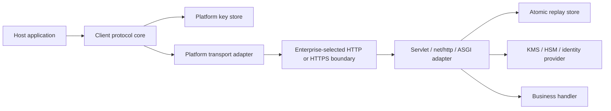

# 威胁模型

## 范围与资产

SDK 保护已安装客户端与 Spring Boot、Go 或 Python 服务端适配器之间的应用请求和
响应。保护资产包括业务明文、会话密钥、安装身份私钥、服务端签名私钥、传输序号、
注册状态与安全策略决策。

协议 v1 可运行在 HTTP 或 HTTPS 上，并独立提供应用层身份绑定、认证路由元数据、明确
key ID 和重放控制。生产环境建议叠加 TLS 1.2+；选择 HTTP 时，目标地址、流量大小、
时序以及未纳入加密信封的传输元数据仍可被观察，也可能受到浏览器或操作系统限制。

## 信任边界

## 威胁与控制

| 威胁 | 必需控制 |
| --- | --- |
| 业务密文或握手身份遭网络攻击 | 受管服务端信任锚、签名握手 transcript、AEAD；生产建议叠加 TLS 1.2+ |
| 密文或路由篡改 | AEAD；逻辑请求整体加密，方向、request ID 和固定传输元数据进入 AAD |
| 重放与乱序 | 会话绑定序号、确定性 nonce、带 TTL 的原子重放存储 |
| 密钥替换或降级 | 签名握手 transcript、服务端套件白名单、禁止静默回退 |
| 客户端密钥提取 | Android Keystore、iOS Keychain/Secure Enclave、不可导出 WebCrypto；Java 文件身份使用 owner-only 权限和原子写入，高安全宿主接入 KeyStore/HSM |
| 服务端密钥暴露 | KMS/HSM 或受控密钥文件、短时会话、按 key/session 撤销 |
| Parser 滥用或资源耗尽 | 严格 JSON、三层大小限制、时间窗口、业务执行前完成校验 |
| 日志泄露 | 只记录分类元数据；禁止 body、密钥、完整 sid/信封/密文 |
| Web 同源脚本注入 | CSP 与应用加固；不可导出密钥只能阻止导出，不能阻止恶意调用 |
| 客户端设备失陷 | 无法保证绝对机密；撤销安装/会话并应用业务风控 |

## 明确非目标

- 协议 v1 不隐藏目标地址、流量大小与时序；
- 使用 HTTPS 时，服务端公钥固定不能替代正常 TLS 证书验证；
- 使用 HTTP 时，协议不隐藏目标地址、流量大小、时序和外层传输元数据；
- JavaScript 密码能力不能阻止已注入的同源脚本调用可用密钥；
- 国密套件标识不代表合规，只有接入经过审计的实现后才能启用；
- SDK 不提供客户端防逆向、业务权限控制或业务幂等。

## 安全不变量

1. 格式、身份、过期、路由、密钥与重放检查在业务代码之前失败关闭；
2. `(session ID, direction, sequence)` 最多接受一次；
3. 请求与响应密钥和 nonce 前缀方向隔离；
4. 每次重试使用新序号、新 nonce 和新传输 request ID；
5. 客户端和服务端都不能静默选择未批准套件或旧协议；
6. Spring、Go、Python 服务端的框架差异不能改变线协议与错误语义。
