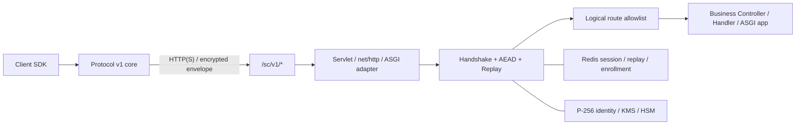

# 架构说明

仓库中的 Spring Boot、Go、Python 服务端和全部客户端共享协议 v1，按以下逻辑层
划分。语言或框架适配不能改变信封、AAD、nonce、错误码和降级规则。

| 层 | 职责 | 当前实现 |
| --- | --- | --- |
| 协议规范 | 字段、字节、AAD、状态、错误和降级规则 | `docs/protocol`、`protocol/test-vectors` |
| 协议核心 | 严格校验、握手、密钥派生和 AEAD；不负责业务网络路由 | Java、Go、Python、JavaScript、Android、iOS 核心 |
| 密钥与状态 | 身份密钥、会话、注册、撤销与重放保护 | 服务端 SPI、内存开发实现、Redis 生产实现 |
| 传输适配 | HTTP 映射、取消、请求重写和响应捕获 | Servlet Filter、`net/http` Handler、ASGI Middleware、客户端平台传输 |
| SDK 公共层 | 按客户端接口契约提供稳定配置、请求/响应/错误和生命周期 API | 各语言可发布包 |
| 宿主业务层 | appId/Origin 准入、逻辑路由、业务鉴权与幂等 | 应用提供的 Authorizer、Handler、Controller、Service |

## 服务端适配

| 实现 | 接入方式 | 请求转发 | 生产状态 |
| --- | --- | --- | --- |
| Spring Boot | Starter 自动配置与 Servlet Filter | `HttpServletRequest` 包装 | Spring Data Redis |
| Go | `httpadapter.New` 包装现有 `http.Handler` | 克隆并重写 `http.Request` | `go-redis/v9` |
| Python | FastAPI 握手路由与 ASGI Middleware | 重写 ASGI scope/receive，捕获 send | `redis.asyncio` |

三种服务端实现均默认关闭且失败关闭；缺少身份、授权或逻辑路由时不能形成可用安全
服务。内存实现只用于单节点开发测试，集群必须使用 Redis 和独立的 32 字节会话记录
保护密钥。

## 数据与信任边界

外层 `m`、`p` 和 `cty` 固定为消息传输值。业务 method、规范化 path、content type、
受保护 header 与 body 作为一个对象整体加密。`rid` 外层可见，但由 AAD 认证，并以
`x-sc-request-id` 交给业务层。

协议支持 HTTP 和 HTTPS。启用服务端 TLS 强制策略时，SDK 不自动信任
`X-Forwarded-Proto`；只有宿主受信代理层可以把连接归一化为安全请求。原明文业务入口
仍必须通过网关、网络分区或应用规则阻断，避免绕过 `/sc/v1/message`。
